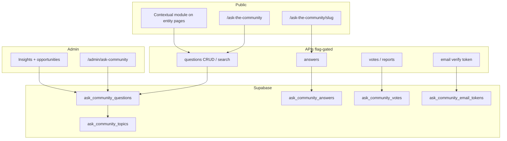

# Ask the 30A Community Hub

## Goal Capsule

Ship a flag-gated **Ask the 30A Community** product: a centralized Q&A hub at `/ask-the-community` plus contextual Ask modules on town, area, business, and guide pages — one underlying system for general and entity-scoped questions, moderated answers, voting, reporting, topic taxonomy, duplicate review, content-opportunity tracking, email notifications, and PostHog analytics.

**Authority:** User PRD update “Ask the Community Hub” (2026-08-02 session) is the product source of truth. This plan decides how to implement it against existing WhereTo30A patterns (`community_tips`, Resend email, PostHog flags, hub pages, admin queues).

**Out of scope for MVP:** public user accounts/profiles, DMs, image uploads, status posts, private groups, following, business-controlled moderation, automated AI answers, fully automated semantic content-gap clustering.

**Stop when:** public hub + detail pages + contextual modules + submit/answer/vote/report + admin moderation/insights + topics + pins + email verify/notify + `ask_community` flag covering all surfaces + PostHog events + OPERATOR-TODO updates are shipped behind the flag (default off).

---

## Product Contract

### Problem

Visitors ask 30A questions that do not belong on a single business, town, or guide page (“Where should we stay with young kids?”, “What is open on Thanksgiving?”). Today there is no structured, searchable community Q&A — only entity-scoped **Community Tips** (short moderated tips) and the AI **Ask** concierge. WhereTo30A also lacks a first-party feed of real visitor demand to drive editorial content.

### Actors

- A1. Visitor (anonymous or email-identified submitter)
- A2. Answerer (email-identified)
- A3. Voter / reporter (anonymous, abuse-protected)
- A4. WhereTo30A admin / moderator
- A5. Editorial operator (content opportunities → guides)

### Requirements

| ID | Requirement | Priority |
|----|-------------|----------|
| R1 | Central hub at `/ask-the-community` with title, intro, Ask CTA, feed, search, topic/location filters, sort, unanswered/popular/recently-active sections | Must |
| R2 | Question detail at `/ask-the-community/[question-slug]` with context, answers, voting, answer form, report, related questions, related WhereTo30A content | Must |
| R3 | Contextual Ask modules on town, area, business, and guide detail pages; submissions auto-associate primary entity | Must |
| R4 | General questions need no primary entity; optional topic/town/area/visitor metadata | Must |
| R5 | Shared data model: `question_scope` ∈ general \| town \| area \| business \| guide; contextual questions appear in central feed | Must |
| R6 | General questions appear on detail pages only when admin associates them (never by keyword alone) | Must |
| R7 | Controlled topic taxonomy with admin add/rename/hide/merge/reassign | Must |
| R8 | Email required for questions and answers; emails never shown publicly; optional display name | Must |
| R9 | Email verification required before a submission can be published | Must |
| R10 | Question statuses: pending, published, answered, closed, duplicate, hidden, removed, spam | Must |
| R11 | Answers with helpful/not-helpful feedback; one accepted answer; admin may mark editorial / most helpful / outdated / needs verification | Must |
| R12 | WhereTo30A editorial answers clearly labeled; do not alter community vote scores | Must |
| R13 | Report action; admin moderation queues | Must |
| R14 | Suggest similar published questions before submit | Must |
| R15 | Admin duplicate link/merge/redirect; content-opportunity statuses; link created content to question | Must |
| R16 | Pin/feature questions with start/end, priority, optional intro | Must |
| R17 | PostHog flag `ask_community` gates all public surfaces, APIs, and community emails | Must |
| R18 | PostHog hub + insight events without PII or question/answer text; no raw search queries by default | Must |
| R19 | Email notifications (verify, answer on your question, optional prefs) | Must |
| R20 | Community Insights admin view (topics, unanswered, opportunity pipeline) | Must |
| R21 | MVP excludes social-network features listed in PRD §14/§23 | Must |

### Key Flows

- F1. Hub ask (general)
  - **Trigger:** Visitor on `/ask-the-community` clicks Ask a Question
  - **Actors:** A1
  - **Steps:** Fill email + question (+ optional fields/topic); see similar questions; submit; receive verify email; after verify enter pending queue; admin publishes; appears in feed
  - **Covered by:** R1, R4, R8, R9, R10, R14

- F2. Contextual ask
  - **Trigger:** Visitor on town/area/business/guide page uses Ask module
  - **Actors:** A1
  - **Steps:** Same as F1 with `question_scope` + primary entity set; question also eligible for central feed with “Asked about [Entity]”
  - **Covered by:** R3, R5

- F3. Answer + vote
  - **Trigger:** Visitor opens question detail
  - **Actors:** A2, A3
  - **Steps:** Submit answer (email + verify → pending → publish); vote helpful/not helpful anonymously; asker may accept one answer; closed questions reject new answers
  - **Covered by:** R2, R9, R10, R11

- F4. Moderation + opportunity
  - **Trigger:** Admin opens community dashboard
  - **Actors:** A4, A5
  - **Steps:** Publish/hide/spam/close; reassign topic; associate entities; mark duplicate; set content_opportunity_*; optionally pin; add editorial answer; link created guide
  - **Covered by:** R7, R12, R13, R15, R16, R20

### Acceptance Examples

- AE1. General hub question
  - **Covers:** R1, R4, R5, R9
  - **Given:** Flag on; visitor submits “What is open on Thanksgiving?” with email, no entity
  - **When:** Email verified and admin publishes
  - **Then:** Question appears on hub as General 30A Question; does not appear on Seaside town page unless admin associates it

- AE2. Contextual → feed
  - **Covers:** R3, R5
  - **Given:** Question submitted from Seaside town page
  - **When:** Published
  - **Then:** Shows on town module and in central feed with “Asked about Seaside”

- AE3. Flag off
  - **Covers:** R17
  - **Given:** `ask_community` false
  - **When:** Visitor hits `/ask-the-community` or APIs
  - **Then:** Redirect home (pages) / 404 (APIs); no contextual module; no community emails sent

- AE4. Privacy
  - **Covers:** R8, R18
  - **Given:** Published question with email and display name
  - **When:** Feed/detail/PostHog events render
  - **Then:** Email never shown; display name optional; events omit question/answer text and emails

### Product Scope

**In:** Hub, detail, contextual modules, topics, filters/search/sort, answers, votes, reports, admin moderation + insights + pins + duplicates + content opportunities, email verify/notify, analytics, full flag protection.

**Out:** Profiles, friends, DMs, timelines, photo albums, multi-reaction social model, business moderation, AI auto-answers, automatic semantic clustering (manual tags/duplicates only for MVP).

---

## Planning Contract

### Key Technical Decisions

| ID | Decision | Rationale |
|----|----------|-----------|
| KTD1 | **New subsystem** `ask-community` (tables + `lib/ask-community/*`), not an extension of `community_tips` | Tips are short, one-per-user-per-entity blurbs. Q&A needs threads, scopes, topics, votes, duplicates, pins. Keep tips unchanged. |
| KTD2 | **Email-token identity**, not required Supabase auth accounts | PRD forbids public profiles and requires email + verify. Reuse portal-invite token pattern (`lib/portal/invites.ts`) + Resend (`lib/email/send.ts`). Optional: if user is already signed in, prefill email; still no public profile surface. |
| KTD3 | **Publication pipeline:** `awaiting_verification` → `pending` → `published` (admin) | Email verify before moderation queue; admin publish before public (matches community tips trust model). `answered` is derived/denormalized when ≥1 published answer exists. |
| KTD4 | **Single questions table** with `question_scope`, nullable `primary_entity_type/id`, M2M `ask_community_question_entities` for optional related entities | Supports general + contextual + later admin associations without duplicating rows. |
| KTD5 | **Postgres FTS** (`tsvector` on question + published answers) for hub search; exclude non-public statuses | Discover-style filters are wrong for Q&A text; business hybrid search is overkill for MVP. |
| KTD6 | **Votes:** `helpful` \| `not_helpful` only (UI may show thumbs as synonyms); anonymous voter key = hashed cookie + IP rate limit | PRD lists four labels; one boolean axis avoids double-counting. No auth required to vote. |
| KTD7 | **Flag `ask_community`:** middleware gate hub + detail like `/ask`; API 404 helpers; `AskCommunityGate` for contextual modules; admin nav `requiresAskCommunity` | Full PRD surface coverage. Dev bypass: `ASK_COMMUNITY_ENABLED=1` / `NEXT_PUBLIC_ASK_COMMUNITY_ENABLED=1`. |
| KTD8 | **SEO:** index published hub + published question pages (unlike AI `/ask`) | PRD goal is a searchable archive of local knowledge. `noindex` pending/hidden/duplicate/spam; robots allow `/ask-the-community`. |
| KTD9 | **Similar questions on submit:** FTS/trigram against published questions; admin marks `duplicate_of_id` + 301/canonical redirect | Manual merge for MVP; no AI clustering. |
| KTD10 | **Content opportunity** fields on question (+ optional link to guide/page); Insights = SQL aggregations in admin | No separate ML pipeline for MVP. |
| KTD11 | **Positioning copy:** “Ask the 30A Community” — not “forum” | Guides hub voice via `BrowseHubHero`; feed feels conversational but structured. |

### Technical Design

**Schema sketch (directional):**

- `ask_community_topics` — slug, name, sort_order, is_hidden, merged_into_id
- `ask_community_questions` — slug, body, context, display_name, email_hash, email_ciphertext_or_vault_ref, question_scope, primary_entity_type/id, topic_id, status, duplicate_of_id, accepted_answer_id, content_opportunity_status, is_featured, view_count, last_activity_at, notify_on_answer, travel_dates, visitor_type, …
- `ask_community_question_entities` — question_id, entity_type, entity_id (related/admin associations)
- `ask_community_answers` — question_id, body, display_name, email_hash, status, is_editorial, admin_labels, helpful_count, not_helpful_count
- `ask_community_votes` — answer_id, voter_key_hash, reaction (`helpful`\|`not_helpful`), unique(answer_id, voter_key_hash)
- `ask_community_reports` — target_type, target_id, reason, reporter_key_hash, status
- `ask_community_email_tokens` — purpose (`verify_question`\|`verify_answer`\|`manage`), token_hash, subject_type/id, expires_at, consumed_at
- `ask_community_pins` — question_id, starts_at, ends_at, priority, editorial_intro
- FTS: generated/updated `search_vector` on questions; refresh when answers publish

**Email storage:** store SHA-256 hash for lookup + application-level encrypted email (or Supabase Vault) for notifications only; never select email into public API serializers.

**Status mapping:**

| Status | Public feed | Accepts answers |
|--------|-------------|-----------------|
| awaiting_verification | no | no |
| pending | no | no |
| published | yes | yes |
| answered | yes (subset of published w/ answers) | yes |
| closed | yes | no |
| duplicate | redirect to canonical | no |
| hidden / removed / spam | no | no |

Note: PRD lists `pending` not `awaiting_verification`. Implement `awaiting_verification` as an internal pre-pending state; admin UI groups both under “needs attention” or only shows `pending` after verify. Public status enum exposed to admin can include both.

### Patterns to Reuse

| Concern | Reuse |
|---------|--------|
| Hub chrome | `components/browse/BrowseHubHero.tsx`, `app/guides/page.tsx` |
| Contextual module placement | After tips-adjacent slots on town/area/business/guide pages (`CommunityTipsSection` neighbors) |
| Flag chain | `community_tips` registration across `feature-flags-core`, resolve, server, client, Gate, admin-nav, OPERATOR-TODO |
| Route gate | `middleware.ts` `/ask` + `/discover` pattern |
| Email send | `lib/email/send.ts` + MJML templates |
| Verify token | `lib/portal/invites.ts` token + TTL + consume-once |
| Rate limit | `lib/rate-limit.ts` IP keys + honeypot `_hp_*` |
| Admin queue | `app/admin/community-tips/*` |
| Slugs | `lib/portal/slug.ts` `slugifyBusinessTitle` + `uniqueSlug` |
| Related guides | `RelatedGuidesSection` / `relatedGuidesForSlug` |
| Reserved root | add `ask-the-community` to `lib/routes/reserved-slugs.ts` |

### Assumptions

- A1. Resend remains available in production (`RESEND_API_KEY`).
- A2. Admins use existing `requireAdminUser` / `ADMIN_EMAILS` model.
- A3. Community Tips and AI Ask remain separate products; no merge in MVP.
- A4. Manual clustering via topics + duplicate links is enough for MVP content-gap detection.
- A5. Indexing published Q&A is desired (KTD8); can flip to noindex later via metadata without schema change.

### Open Questions

| ID | Question | Status |
|----|----------|--------|
| OQ1 | Auto-publish after email verify vs always admin-moderate? | **Resolved:** always admin-moderate after verify (KTD3) |
| OQ2 | Require Supabase login? | **Resolved:** email tokens only (KTD2) |
| OQ3 | Index in Google? | **Resolved:** yes for published (KTD8) |
| OQ4 | Exact vote UX (two buttons vs four) | **Deferred:** implement helpful/not_helpful; UI copy can say thumbs up/down |
| OQ5 | Encrypt-at-rest mechanism for emails (Vault vs pgcrypto vs app key) | **Deferred to impl:** pick existing repo secret pattern; must not leak via PostgREST selects |

### Sequencing

1. Schema + flag plumbing (unblocks all)
2. Submit/verify/admin publish path (vertical slice)
3. Hub feed + detail + answers/votes/reports
4. Contextual modules
5. Similar questions + duplicates
6. Topics admin, pins, editorial answers, insights
7. Notifications + PostHog events + OPERATOR-TODO / sitemap / nav

---

## Implementation Units

### U1. Schema, types, and query layer

- **Goal:** Durable data model and typed access for questions, answers, topics, votes, reports, tokens, pins.
- **Files:**
  - Create: `scripts/migrations/ask-community.sql`
  - Create: `lib/ask-community/schema.ts`, `types.ts`, `queries.ts`, `slugs.ts`, `email-privacy.ts`, `rate-limit.ts`
  - Test: `lib/ask-community/schema.test.ts`, `lib/ask-community/slugs.test.ts`
- **Patterns:** `scripts/migrations/community-tips.sql`, `lib/community-tips/*`
- **Depends on:** —
- **Requirements:** R5, R7, R8, R10, R15, R16
- **Test scenarios:**
  - Schema zod rejects invalid scope/status/topic
  - Slugify + uniqueSlug collision suffix
  - Serializer strips email fields from public DTOs
  - Status/visibility helper: only published/answered/closed visible publicly

### U2. Feature flag and route shells

- **Goal:** `ask_community` registered and gating hub/detail/APIs/admin nav; empty shells render when on.
- **Files:**
  - Modify: `lib/feature-flags-core.ts`, `lib/feature-flags.ts`, `lib/feature-flags-client.ts`, `lib/feature-flags-client-utils.ts`, `middleware.ts`, `lib/admin/admin-nav.ts`, `lib/routes/reserved-slugs.ts`, `app/robots.ts`, `lib/seo/sitemap-strategy.ts` (add hub when flag conceptually public — sitemap generation should only include if always-on build or include URL; follow how other flagged hubs are handled — `/ask` is disallowed; for KTD8 allow robots and add hub to sitemap)
  - Create: `components/feature-flags/AskCommunityGate.tsx`
  - Create: `app/ask-the-community/page.tsx`, `app/ask-the-community/[slug]/page.tsx` (shell)
  - Create: `app/admin/ask-community/page.tsx` (shell)
  - Modify: `docs/OPERATOR-TODO.md` (flag checklist + changelog row — finalize in U12 if preferred, but add stub checkboxes here)
- **Patterns:** `community_tips` flag chain; `/ask` middleware redirect
- **Depends on:** U1 (light — can parallelize shells before migration apply)
- **Requirements:** R1, R2, R17
- **Test scenarios:**
  - `isAskCommunityEnabled` false by default
  - Middleware redirects `/ask-the-community` when flag off
  - API helper returns 404 when flag off
  - Reserved slug includes `ask-the-community`

### U3. Question submission + email verification

- **Goal:** Create questions from hub (general) with verify email → pending.
- **Files:**
  - Create: `app/api/ask-community/questions/route.ts`
  - Create: `app/api/ask-community/verify/route.ts`
  - Create: `lib/ask-community/notifications.ts`, `lib/email/templates/ask-community-verify.mjml`
  - Create: `components/ask-community/AskQuestionForm.tsx`
  - Modify: hub page to host form
  - Test: `lib/ask-community/notifications.test.ts` or route tests if present pattern exists
- **Patterns:** `lib/listing-requests/free-onboard-notify.ts`, portal invite tokens, honeypot + `rateLimitKeyFromRequest`
- **Depends on:** U1, U2
- **Requirements:** R4, R8, R9, R19
- **Test scenarios:**
  - Valid submit creates `awaiting_verification` and sends email when Resend configured
  - Honeypot returns ok without write
  - Rate limit trips after threshold
  - Verify token transitions to `pending` and consumes token
  - Expired/invalid token rejected
  - Public GET does not return awaiting/pending rows

### U4. Hub feed, filters, search, sort

- **Goal:** Community hub experience matching PRD §3/§7/§8.
- **Files:**
  - Create: `components/ask-community/CommunityHubClient.tsx`, `QuestionCard.tsx`, `FeedFilters.tsx`
  - Create: `lib/ask-community/feed.ts`, `search.ts`
  - Create: `app/api/ask-community/feed/route.ts`
  - Modify: `app/ask-the-community/page.tsx`
  - Test: `lib/ask-community/feed.test.ts`, `lib/ask-community/search.test.ts`
- **Patterns:** `GuidesHubClient` + Discover facet URL state (lighter)
- **Depends on:** U1, U2, U3 (needs published fixtures)
- **Requirements:** R1, R5
- **Test scenarios:**
  - Default order prefers `last_activity_at` then unanswered attention rules per feed helper
  - Filter by topic/town/area/answered/unanswered
  - Search matches question + published answer text; excludes hidden/pending/spam
  - Cards omit emails; show topic, entity label, answer count, helpful totals, status

### U5. Question detail, answers, votes, reports, accept

- **Goal:** Full discussion page.
- **Files:**
  - Create: `components/ask-community/QuestionDetail.tsx`, `AnswerForm.tsx`, `AnswerList.tsx`, `VoteControls.tsx`, `ReportControl.tsx`
  - Create: `app/api/ask-community/answers/route.ts`, `votes/route.ts`, `reports/route.ts`
  - Modify: `app/ask-the-community/[slug]/page.tsx`
  - Create: verify path reuse for answers
  - Test: `lib/ask-community/votes.test.ts`
- **Patterns:** detail page server fetch + client interactions; related guides section
- **Depends on:** U3, U4
- **Requirements:** R2, R11, R12, R13
- **Test scenarios:**
  - Closed question rejects new answers
  - Duplicate slug redirects to canonical
  - Vote upsert same voter_key flips/sets once; counts update
  - Accept answer: only one accepted; requires asker token or admin
  - Editorial answer flagged visually; vote counts unchanged by editorial mark
  - Report creates moderation row without exposing reporter email

### U6. Contextual modules on entity pages

- **Goal:** Ask module on town/area/business/guide pages; primary entity association; list recent entity questions.
- **Files:**
  - Create: `components/ask-community/ContextualAskSection.tsx`
  - Modify: `app/town/[slug]/page.tsx`, `app/area/[slug]/page.tsx`, `app/business/[slug]/page.tsx`, `app/guide/[slug]/page.tsx`
  - Extend questions API for scope+entity create
  - Test: association rules unit test in `lib/ask-community/entities.test.ts`
- **Patterns:** `CommunityTipsSection` placement (near end of main column, gated)
- **Depends on:** U3, U5
- **Requirements:** R3, R5, R6
- **Test scenarios:**
  - Contextual create sets scope + primary entity
  - General question not returned by entity module query unless M2M association exists
  - Gate hides module when flag off

### U7. Similar questions + admin duplicates

- **Goal:** Prefill similar suggestions; admin duplicate link/merge/redirect.
- **Files:**
  - Create: `app/api/ask-community/similar/route.ts`
  - Create: `lib/ask-community/similar.ts`, `duplicates.ts`
  - Modify: `AskQuestionForm.tsx`, admin client
  - Test: `lib/ask-community/similar.test.ts`
- **Depends on:** U4, U5
- **Requirements:** R14, R15
- **Test scenarios:**
  - Similar returns only published
  - Mark duplicate sets status + `duplicate_of_id`; detail redirects
  - Merge answers moves published answers to canonical and closes duplicate

### U8. Topics admin + pins + editorial answers

- **Goal:** Taxonomy management, pins, WhereTo30A answers.
- **Files:**
  - Create: `app/api/admin/ask-community/topics/route.ts`, `pins/route.ts`, …
  - Extend: `components/admin/AskCommunityAdminClient.tsx` (or split Topics/Pins panels)
  - Seed: initial topics from PRD §6 in migration or seed SQL
  - Test: topic merge reassigns questions and hides source
- **Depends on:** U1, U2, U5
- **Requirements:** R7, R12, R16
- **Test scenarios:**
  - Merge topics repoints questions
  - Expired pins excluded from hub pin query
  - Editorial answer `is_editorial=true` with label path

### U9. Admin moderation + Community Insights

- **Goal:** Full admin dashboard per PRD §19/§11.
- **Files:**
  - Create: `components/admin/AskCommunityAdminClient.tsx`, insights queries in `lib/ask-community/insights.ts`
  - Create: `app/api/admin/ask-community/route.ts` (list/actions)
  - Modify: `app/admin/ask-community/page.tsx`
  - Test: `lib/ask-community/insights.test.ts`
- **Patterns:** `CommunityTipsAdminClient`
- **Depends on:** U3–U8
- **Requirements:** R13, R15, R20
- **Test scenarios:**
  - Pending queue lists only pending
  - Actions: publish/hide/spam/close/reopen/reassign topic/associate entity
  - Content opportunity status transitions
  - Link guide to question sets display flag for “WhereTo30A created a guide…”
  - Insights aggregations exclude spam/removed

### U10. Notifications, analytics, operator docs, polish

- **Goal:** Notify on answers (prefs), PostHog events, OPERATOR-TODO complete, nav/SEO polish.
- **Files:**
  - Create: MJML answer-notify template; `lib/ask-community/analytics.ts`
  - Modify: public components to `captureEvent` / server `posthog-server` on admin insight actions
  - Modify: `docs/OPERATOR-TODO.md` (flag table, setup section, changelog)
  - Optional nav link in footer/nav when flag on (follow discover/ask nav pattern if any)
  - Test: analytics payload redaction unit test (no text/email keys)
- **Depends on:** U4–U9
- **Requirements:** R17, R18, R19
- **Test scenarios:**
  - Notify sends only when `notify_on_answer` and email decryptable
  - Events include `question_id`, `question_scope`, `feature_flag_variant`; omit body/email/display_name/raw query
  - Search analytics stores result_count + topic filters only
  - OPERATOR-TODO lists SQL path + PostHog flag + local bypass env vars

---

## Verification Contract

- Unit: `npm test` / existing vitest (or repo’s `pnpm test`) targeting `lib/ask-community/**/*.test.ts`
- Typecheck/lint per repo norms (`npm run lint` if standard)
- Manual / browser (flag on via dev bypass):
  - Hub load, submit, verify link, admin publish, appear in feed
  - Contextual submit from one town page
  - Answer + vote + report
  - Duplicate redirect
  - Flag off: hub redirects home; module hidden
- SQL: apply `scripts/migrations/ask-community.sql` on staging Supabase before QA
- Do not send PII to PostHog in QA builds

---

## Definition of Done

**Global**

- [ ] All Must requirements R1–R21 met behind `ask_community` (default off)
- [ ] Migration + OPERATOR-TODO changelog/checkboxes committed
- [ ] No email addresses in any public API JSON
- [ ] Community Tips and AI Ask unchanged in behavior
- [ ] Tests for schema, feed/search visibility, votes, flag defaults, analytics redaction

**Per unit**

- [ ] U1: migration applies cleanly; public DTO tests pass
- [ ] U2: middleware + reserved slug + admin nav gated
- [ ] U3: verify email path works with Resend in staging
- [ ] U4: hub filters/search/sort match PRD defaults
- [ ] U5: detail discussion + closed/duplicate behavior
- [ ] U6: four entity page types show gated module; R6 enforced
- [ ] U7: similar suggestions + admin duplicate merge
- [ ] U8: seeded topics; pins expire; editorial label
- [ ] U9: moderation + insights + opportunity statuses
- [ ] U10: notifications + PostHog events + operator doc

---

## Appendix

### Origin PRD summary

User-provided PRD sections 1–24 define dual experience (contextual + hub), goals, feed, topics, statuses, insights, duplicates, social boundaries, business-question rules, analytics event names, and MVP in/out lists. Product positioning: “Ask the 30A Community,” not a general forum.

### Suggested initial topics (seed)

Where to Stay; Restaurants and Dining; Things to Do; Beaches; Families and Kids; Events; Shopping; Nightlife; Transportation and Parking; Weather; Pet-Friendly; Gluten-Free and Dietary Needs; Weddings and Groups; Local Residents; Moving to the Area; General Advice.

### PostHog events (implement in U10)

Hub: `ask_community_hub_viewed`, `ask_community_feed_question_clicked`, `ask_community_search_performed`, `ask_community_filter_applied`, `ask_community_sort_changed`, `ask_community_unanswered_viewed`, `ask_community_topic_viewed`, `ask_community_related_content_clicked`

Insights: `ask_community_question_marked_content_opportunity`, `ask_community_content_opportunity_planned`, `ask_community_content_created`, `ask_community_question_linked_to_content`, `ask_community_duplicate_detected`, `ask_community_duplicate_merged`

Plus existing-style submit/vote events as needed with redacted props only.

### Explicit non-goals reminder

No user profiles, friends, followers, DMs, personal timelines, status posts, photo albums, business suppression of compliant criticism, AI-published summaries without editorial review.
