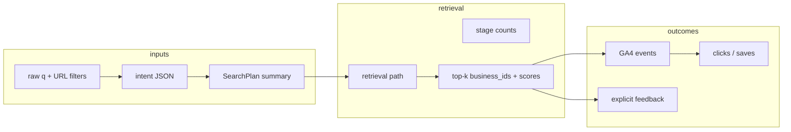
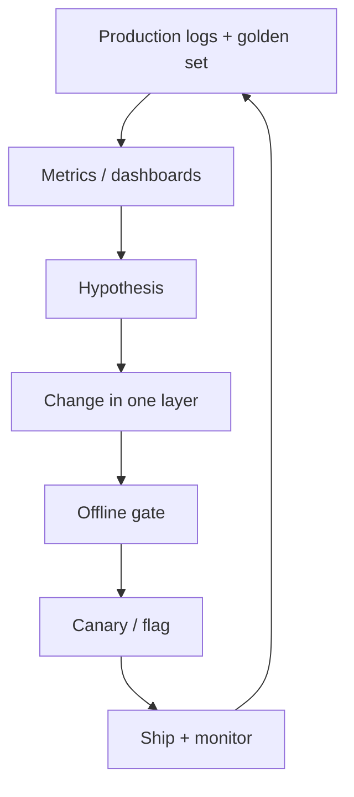

# Search quality — evaluation & improvement plan

**Audience:** data science, product, engineering  
**Scope:** live search only (`runSearch` → minimal pipeline). Legacy `query_cache` / `buildRecommendationSet` is out of scope until [search-legacy.md](./search-legacy.md) is migrated.

**Related:** [search-pipeline.md](./search-pipeline.md) (architecture), [analytics-events.md](./analytics-events.md) (GA4 today)

---

## 1. Goals

| Goal | Question we answer |
|------|-------------------|
| **Reliability** | Are users getting *any* reasonable results? (zero-result rate, wrong category) |
| **Relevance** | Are top results *about* what they asked for? (precision@k, nDCG on labeled set) |
| **Engagement** | Do users click, save, or visit listings after search? (CTR@k, time-to-click) |
| **Efficiency** | Are we paying for OpenAI/embeddings without quality gain? (path mix, cost per successful session) |
| **Regression** | Did a deploy hurt a query class we care about? (golden-set CI + weekly drift) |

Success is not “perfect ranking everywhere on day one.” It is **measured movement** on a fixed eval set + **online guardrails** that catch regressions before users feel them.

---

## 2. System map (what to log per search)

Each search request should be joinable end-to-end. Today most of this exists **only in dev** (`_debug`, `_retrieval`) or **not at all** server-side.



### 2.1 Minimum event schema (`search_impression` — **recommended new table**)

Store one row per **search execution** (not per page view refresh if deduped by `query_hash` + session). Sample in prod (e.g. 100%) once volume is understood.

| Field | Source today | Use in eval |
|-------|----------------|-------------|
| `id`, `created_at` | new | time series |
| `session_id` / `anonymous_id` | cookie or GA client id | session funnels |
| `user_id` | auth optional | cohorts |
| `raw_query`, `normalized_query` | `runSearch` | clustering, typos |
| `query_hash` | `SearchPlan` | dedupe, A/B buckets |
| `page`, `page_size` | explicit constraints | pagination bias |
| `intent_category`, `intent_town`, `specific_items` | `SearchIntent` | stratify evals |
| `resolved_category_slugs`, `town_ids`, `vibe_tags`, `price_bucket` | `resolved_filters` | filter correctness |
| `retrieval_path` | `SearchRetrievalMetrics.path` | strict vs relaxed vs ilike |
| `attempted_paths` | JSON array | ladder diagnostics |
| `rpc_row_count`, `after_vec_floor`, `after_post_rank_*`, `after_sidebar_filters` | metrics | funnel drop-off |
| `total_results` | payload | zero-result KPI |
| `top_business_ids` | first 12 ids | offline replay, nDCG |
| `top_vec_sims`, `top_composites` | dev fields today | threshold tuning |
| `openai_intent_used`, `embedding_used` | flags | cost vs quality |
| `latency_ms_intent`, `latency_ms_total` | timers | perf |
| `app_version` / `git_sha` | deploy | regression attribution |

**Privacy:** do not log full IP; hash queries if needed for GDPR-style minimization; avoid logging PII in `raw_query` beyond what user typed in a public search box.

### 2.2 Outcome events (join to impression)

| Event | Exists? | Join key |
|-------|---------|----------|
| `search` (GA) | yes — submit | `search_term`, weak |
| `search_filter_change` | yes | filter deltas only |
| Result card click | partial via `data-analytics-*` on cards | add `search_impression_id` + `rank` + `business_id` |
| Business page view after search | GA page_view + referrer | session + time window |
| Save / share | if product has it | user + business_id |
| “No good results” feedback | not built | future micro-survey |

Without **`search_impression_id`** on clicks, online CTR@k is guesswork. That is the highest-leverage instrumentation gap.

---

## 3. Metric layers

### 3.1 Online (production monitoring)

**Volume & health (daily dashboard)**

- Searches / DAU, unique queries, query length distribution  
- **Zero-result rate** = `total_results = 0` / searches  
- **Low-result rate** = `total_results < 3`  
- **Path mix:** % `hybrid_strict`, `hybrid_relaxed`, `ilike`, `browse_no_text`  
- **Relaxation rate:** % where `attempted_paths` includes `hybrid_relaxed`  
- **Category resolution rate:** intent category vs resolved slug vs explicit URL category  
- **Latency p50/p95** end-to-end  

**Quality proxies (weekly)**

- **CTR@1, CTR@3, CTR@10** on result cards (needs click join)  
- **Abandonment:** search with no click within 60s  
- **Filter churn:** searches with >2 filter changes before click (possible bad defaults)  
- **Repeat query:** same normalized query twice in session (possible dissatisfaction)  

**Alerts (examples)**

- Zero-result rate ↑ 50% vs 7-day baseline for any category slug  
- `hybrid_relaxed` share ↑ sharply (strict tier too tight or data drift)  
- `ilike` share ↑ (embeddings off, RPC failures, or strict path empty)  
- p95 latency > budget  

### 3.2 Offline (labeled golden set)

Build a **frozen query set** (start 80–150 rows, grow to 300+) stratified by intent class:

| Stratum | Examples | Primary metric |
|---------|----------|----------------|
| Single-token retail | `clothing`, `books` | precision@5, zero-result |
| Dish + town | `fish tacos seaside` | dish in top 3, town filter |
| Category + town NL | `restaurants near rosemary` | category + geo |
| Vibe / occasion | `romantic dinner` | tag/atmosphere alignment |
| Browse / empty q | category chip only | browse path, no false text filter |
| Edge / regression | queries that broke in past incidents | must-not-regress |

**Labels per query (spreadsheet → JSON → Vitest or script):**

- `expected_category` (slug or null)  
- `expected_town` (slug or null)  
- `relevant_business_ids[]` — human curated “definitely good”  
- `bad_business_ids[]` — “must not appear in top 10”  
- `min_results` — usually 1 or 3  
- `notes` — why this case matters  

**Offline scores (automate in CI on PRs touching `lib/search/`):**

```
precision@k     = |relevant ∩ top_k| / k
recall@k        = |relevant ∩ top_k| / |relevant|
bad_in_top_k    = |bad ∩ top_k|  (must be 0 for release gate)
zero_result     = total_results == 0 when min_results >= 1
category_match  = resolved category == expected_category
path_expectation = optional: e.g. clothing → not ilike-only unless embed off
```

**nDCG@10** when you have graded relevance (0/1/2) instead of binary lists.

### 3.3 Human / LLM eval (monthly deep dive)

Use for **subjective** quality and copy, not daily ops.

1. Sample 50 searches from production logs (stratified by path and zero-result).  
2. Raters (or LLM judge with **fixed rubric**) score 1–4:  
   - Intent understood?  
   - Top 3 results on-topic?  
   - Would a 30A visitor trust this list?  
3. Store `query_id`, `rater`, `scores`, `free_text`.  
4. Compare month-over-month; drill into strata where score drops.

LLM-as-judge is useful for **scalable pre-labeling**; human spot-check 10% before trusting aggregates.

---

## 4. Closed loop — how evals change search

Rank changes should map to **one control surface** (see [search-pipeline.md](./search-pipeline.md)). Avoid one-off `if (query)` patches without a metric.



### 4.1 Control surfaces (what evals may adjust)

| Layer | Knobs | When eval says change it |
|-------|--------|---------------------------|
| **Data** | `item_tags`, `search_keywords`, `qa_document`, embeddings backfill | High RPC rows but low precision; dish/apparel gates firing often |
| **Intent** | keyword fast-path, `PARSE_SYSTEM`, `repairFoodCategoryWhenQueryIsRetail` | category mismatch rate high; OpenAI vs keyword disagreement |
| **Plan** | `buildTextSearchPlan`, town/category resolution | wrong town; ILIKE on/off surprises |
| **RPC** | `hybrid_search_businesses`, future `p_mode` | path stuck in relaxed; TS gates doing all the work |
| **Rank config** | `DEFAULT_SEARCH_RANK_CONFIG` in `hybrid-vector-postprocess.ts` | strict too empty → ↑ relaxed rate; too noisy → ↑ composite threshold |
| **Degradation ladder** | when to step strict → relaxed → ilike | relaxation rate vs zero-result tradeoff |
| **Flags** | `SEARCH_QUERY_EMBEDDINGS`, `SEARCH_OPENAI_INTENT_PARSE` | cost vs quality A/B |

### 4.2 Release policy (recommended)

1. **PR touching search:** run offline golden set; block if `bad_in_top_10 > 0` on regression tier or precision@5 drops > X% on any stratum.  
2. **Config-only change:** require before/after diff report on golden set + note expected path mix shift.  
3. **Production:** 7-day monitor on zero-result + relaxation rate + CTR@3 after deploy.  
4. **Rollback:** revert `SearchRankConfig` or flag — not ad-hoc hotfix forks.

### 4.3 Example playbooks (from your recent incidents)

| Symptom | Diagnose | Likely fix surface |
|---------|----------|-------------------|
| `clothing` → 0 results | `after_post_rank_strict=0`, path=`ilike` | relaxed ladder, data keywords, RPC shopping mode |
| `clothing` → 25 gift shops | `path=hybrid_relaxed`, low apparel evidence | strict tier + apparel gate; backfill tags |
| Same query 0 vs many prod/local | intent category null vs shopping | intent repair + category in RPC |
| Dish query, wrong venues | dish gate bypass / high vec only | `item_tags` backfill, dish gate vec floor |

---

## 5. Implementation roadmap

### Phase A — Observability (2–3 weeks eng)

- [ ] Supabase table `search_impressions` + server write in `executeSearchFromPlan` (sampled).  
- [ ] Promote `SearchRetrievalMetrics` from dev-only to **sampled prod** (no full intent in GA).  
- [ ] Add `search_result_click` with `impression_id`, `rank`, `business_id`.  
- [ ] Daily SQL views or Metabase/Hex: zero-result, path mix, top queries by zero-result count.

### Phase B — Golden set & CI (1–2 weeks DS + eng)

- [ ] `eval/search-golden.json` + script `local/eval-search.ts` calling `runSearch` against staging DB.  
- [ ] GitHub Action on `lib/search/**` changes.  
- [ ] Document labeling guide for new queries (when adding a bug fix, add a golden row).

### Phase C — Online quality loop (ongoing DS)

- [ ] Weekly report: top 20 zero-result queries, top 20 relaxed-path queries, CTR@3 by category.  
- [ ] Monthly human/LLM eval sample.  
- [ ] Quarterly: prune dead TS branches using path metrics (“relaxed never helps stratum X”).

### Phase D — Tuning & RPC (eng, driven by A–C)

- [ ] Move stratum-specific thresholds into `SearchRankConfig` experiments (env or remote config).  
- [ ] Implement `p_mode` on RPC; **delete** matching TS forks per [search-pipeline.md](./search-pipeline.md) Phase 4 table.  
- [ ] Optional: multi-arm bandit on composite threshold per category (only after logging stable).

---

## 6. SQL sketches (monitoring)

**Zero-result rate (last 7 days)**

```sql
select
  date_trunc('day', created_at) as day,
  count(*) filter (where total_results = 0)::float / nullif(count(*), 0) as zero_result_rate,
  count(*) as searches
from search_impressions
where created_at > now() - interval '7 days'
group by 1
order by 1;
```

**Path mix**

```sql
select retrieval_path, count(*) as n,
       avg(total_results) as avg_results
from search_impressions
where created_at > now() - interval '7 days'
group by 1;
```

**Top zero-result queries**

```sql
select normalized_query, intent_category, count(*) as n
from search_impressions
where total_results = 0
  and created_at > now() - interval '30 days'
group by 1, 2
order by n desc
limit 30;
```

**Relaxation funnel**

```sql
select
  avg(rpc_row_count) as avg_rpc,
  avg(after_post_rank_strict) as avg_after_strict,
  avg(after_post_rank_relaxed) as avg_after_relaxed,
  avg(total_results) as avg_final
from search_impressions
where retrieval_path in ('hybrid_strict', 'hybrid_relaxed')
  and created_at > now() - interval '7 days';
```

---

## 7. GA4 today vs what you still need

**Today:** `search`, `search_filter_change`, chip events — good for product funnels, **weak for relevance** (no result ids, ranks, or path).

**Keep GA4 for:** marketing funnels, filter usage, high-level search volume.

**Use `search_impressions` for:** DS quality work, joins to clicks, offline replay exports.

---

## 8. Roles

| Role | Owns |
|------|------|
| **Data science** | Golden set, dashboards, weekly metrics, experiment analysis, labeling rubric |
| **Engineering** | Logging schema, CI eval runner, config/RPC changes, latency |
| **Product / editorial** | Label relevance for ambiguous strata, prioritize query classes |
| **Operator** | Embeddings/BI backfill when evals show data gaps ([OPERATOR-TODO.md](./OPERATOR-TODO.md)) |

---

## 9. First 30 days (concrete)

| Week | Deliverable |
|------|-------------|
| 1 | Approve `search_impressions` schema; ship server logging (staging) |
| 2 | 50-query golden v0 + manual labels; first offline report |
| 3 | Click join + zero-result dashboard; list top 10 failing queries |
| 4 | One controlled change (e.g. `SearchRankConfig` or intent fast-path) with before/after golden + 7-day online monitor |

---

**Bottom line:** Treat search quality as a **logged, labeled, gated loop** — production tells you *what* breaks, the golden set tells you *if* a fix worked, and changes go through **named control surfaces** (config, data, RPC) instead of new query-shape forks.
