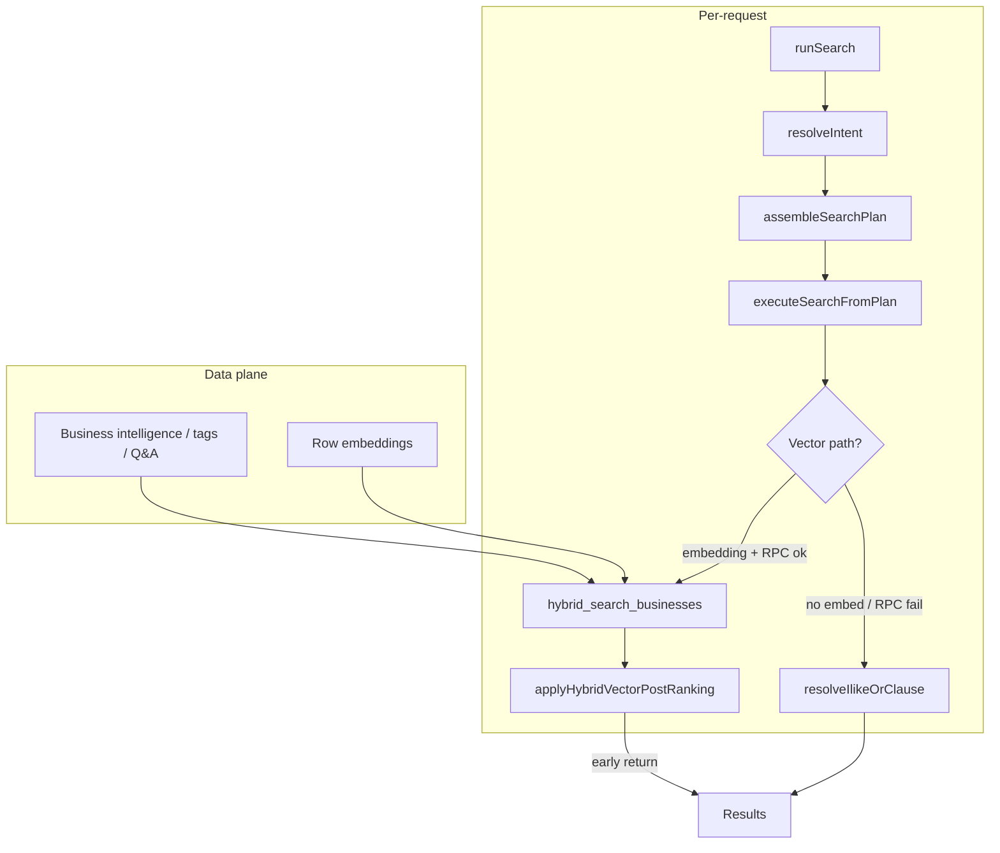

# Search pipeline — re-evaluation (architecture)

This document captures **why** the current `/search` + `runSearch` path feels fork-heavy, and a **direction** to simplify without accumulating more one-off branches in application code.

## What runs today (mental model)

**Legacy / parallel:** `buildRecommendationSet` + `query_cache` + `synthesizeWithOpenAI` (precompute / older flows) — different stack from minimal search; operators should treat it as a separate product surface until unified or retired.

## Why it feels “hacky”

| Layer | Issue |
|--------|--------|
| **Intent** | OpenAI parse, keyword `tryKeywordIntentMatch`, `repairFoodCategoryWhenQueryIsRetail`, env `SEARCH_OPENAI_INTENT_PARSE`, fast-path word limits — several independent ways the same string becomes `SearchIntent`. |
| **runSearch** | Large block that derives `filterCategoryIds`, `resolvedTownId`, `skipIlike`, `searchTermOverride` from combinations of URL vs AI — implicit state machine, hard to reason about edge cases. |
| **Vector path** | RPC returns candidates, then **many sequential filters** with overlapping purposes: composite threshold, title rescue, “salvage” when empty, *another* salvage when structured intent, apparel-only vec fallback, restaurant dish gate, shopping apparel gate, price/town/tag filters. Thresholds differ by query shape (`minimalApparelKw`, etc.). |
| **ILIKE path** | Second ranking world; wide OR only for some apparel shapes — another fork. |
| **Quality vs recall** | Gates fix bad vector neighbors (gift shops for “clothing”) but fight **sparse `item_tags` / BI** — app code compensates for data coverage with floors and salvages. Each fix adds a branch instead of fixing the root signal. |

None of this is “wrong” for shipping quickly — it is **technical debt from stacking local maxima** (0 results → salvage; too much noise → gate; gate too strict → lower floor; other queries regress → minimal-keyword fork).

## Principles for a simpler design

1. **One ranking story per request** — Either trust hybrid RPC end-to-end with light post-processing, or trust FTS/ILIKE with light post-processing — avoid two full systems both trying to be “the” ranker unless the product explicitly defines a merge strategy.
2. **Push constraints to the data plane** — Category + town + “not accommodation” belong in SQL/RPC parameters. “Looks like apparel retail” is better as a **computed column**, **materialized facet**, or **narrower RPC mode** than five layers of TS thresholds.
3. **Intent = coarse routing only** — Category, town, price, vibes, maybe 1–2 `specific_items` for display — not a second scoring engine competing with `hybrid_search_businesses` unless structured match is intentionally first-class (then document one formula and one fallback).
4. **Explicit degradation ladder** — e.g. `(A) hybrid strict → (B) hybrid relaxed RPC param → (C) FTS/ILIKE` with metrics at each step — instead of many silent salvages inside step A.
5. **Kill forks by measurement** — Log `path=vector|ilike`, `rpc_row_count`, `after_composite`, `after_gate`, `query_shape` (minimal token vs NL) in dev or sampled prod; delete branches that never fire or don’t move quality metrics.

## Suggested refactor phases (no order implied mandatory)

### Phase 1 — Document & measure (**partial**)

**Implemented (dev):** `SearchRetrievalMetrics` on `_debug.retrieval` and `_retrieval` when `NODE_ENV=development`:

- `path`: `hybrid_strict` | `hybrid_relaxed` | `ilike` | `browse_no_text`
- `attempted_paths`, `rpc_row_count`, `after_vec_floor`, `after_post_rank_strict`, `after_post_rank_relaxed`, `after_sidebar_filters`, `ilike_applied`

Still TODO: fixture matrix (clothing, dish + town, browse, area) × expected path in a test doc or Vitest table.

### Phase 2 — Collapse post-RPC forks (**hybrid vector path**)

**Implemented:** `lib/search/hybrid-vector-postprocess.ts`

- **`DEFAULT_SEARCH_RANK_CONFIG` / `SearchRankConfig`** — single source for composite thresholds, salvage vec floors, apparel fallback floor, scoped vec floor tweak (values consumed by `recommendation-set-minimal` for pre-score vec filtering where applicable).
- **`applyHybridVectorPostRanking()`** — one function after RPC scoring: composite cut → title rescue → salvage ladder (unstructured / structured / minimal-apparel vec fallback) → restaurant dish gate → shopping apparel gate.
- **`itemMatchesTaggedRow`** — exported for `computeStructuredMatch` in `recommendation-set-minimal.ts` (avoids duplicating tag-matching).
- **`recommendation-set-minimal.ts`** — still owns hybrid RPC, accommodation strip, vec-floor **before** `_composite` attachment, and ILIKE fallback; post-`scored` behavior is delegated.

_Future:_ optional rename to `applyIntentPostFilters` if restaurant vs shopping gates gain more dispatch; current structure already centralizes the fork chain.

### Degradation ladder (**implemented**)

1. **`hybrid_strict`** — composite + title rescue + intent gates; no salvage ladder.
2. **`hybrid_relaxed`** — same pool + salvage ladder (structured / apparel vec / composite tail).
3. **`ilike`** — if hybrid yields zero rows after sidebar filters (or vector unavailable).

Implemented in `buildMinimalSearchResult` via `relaxationTier` on `applyHybridVectorPostRanking`.

### Phase 3 — Narrow `runSearch` (**implemented**)

**Modules:**

| File | Role |
|------|------|
| `lib/search/search-plan.ts` | `SearchPlan` type; pure `normalizeExplicitConstraints`, `buildSearchQueryHash`, `buildTextSearchPlan`, `buildIntentScoringSignals` |
| `lib/search/resolve-search-plan.ts` | Async `resolveCategoryFilter`, `resolveTownFilter`, `assembleSearchPlan` (DB + merge) |
| `lib/search/execute-search-from-plan.ts` | Maps plan → `buildMinimalSearchResult` + `resolved_filters` + dev `_debug` |
| `lib/search/ilike-text-search.ts` | ILIKE OR clause builders (`resolveIlikeOrClause`) |
| `lib/search/run-search.ts` | Thin orchestrator: intent/embed → plan → execute |

`runSearch` no longer embeds the category/town/ILIKE state machine inline.

### Phase 4 — RPC / SQL owns relevance (**cleanup target for #2**)

Today, **TypeScript compensates** for one RPC shape. When you add SQL/RPC modes, **delete or narrow** these app-layer workarounds (do not tune them in parallel forever):

| TS workaround (remove after RPC) | File |
|----------------------------------|------|
| `vecFloorMinimalApparelScoped`, apparel-scoped vec floor | `recommendation-set-minimal.ts`, `SearchRankConfig` |
| `minimalApparelKw` larger `match_count` | `recommendation-set-minimal.ts` |
| `applyShoppingApparelRetailGate` / relaxed gate for single-token apparel | `hybrid-vector-postprocess.ts` |
| `buildApparelShoppingIlikeOrClause` wide OR | `ilike-text-search.ts` |
| Structured salvage + `apparelVecFallbackFloor` for empty composite | `hybrid-vector-postprocess.ts` (`relaxed` tier) |

**Proposed RPC contract:** `hybrid_search_businesses(..., p_mode text)` e.g. `general` | `shopping_apparel` | `restaurant_dish` — mode sets category bias, vec floor, and optional text-signal requirements in SQL.

**Data plane (same phase):** backfill `search_keywords`, `item_tags`, slugs so strict hybrid + ILIKE need fewer fallbacks.

### Phase 5 — Legacy (**documented**)

See [search-legacy.md](./search-legacy.md). Precompute cron is **off**; `query_cache` still serves SEO/town/share reads. Live search does **not** call `buildRecommendationSet`.

## What *not* to do next

- Add another `if (query looks like X)` threshold fork without Phase 1 metrics.
- Tune composite vs vec vs gate constants in isolation — they are coupled; changes should go through the relaxation ladder or RPC.

## Related files (today)

| Area | File |
|------|------|
| Request orchestration | `lib/search/run-search.ts` |
| Plan assembly | `lib/search/search-plan.ts`, `lib/search/resolve-search-plan.ts` |
| Plan execution | `lib/search/execute-search-from-plan.ts` |
| Post-RPC ranking | `lib/search/hybrid-vector-postprocess.ts` |
| ILIKE text | `lib/search/ilike-text-search.ts` |
| Minimal SERP | `lib/search/recommendation-set-minimal.ts` |
| Intent | `lib/search/recommendation-set.ts` (`resolveIntent`), `lib/ai/search-ai.ts` |
| Embeddings / flags | `lib/search/query-embedding.ts`, `lib/search/search-openai-flags.ts` |
| RPC | `supabase/migrations/*hybrid_search*` |

---

**Bottom line:** the product behavior is salvageable; the **architecture** needs consolidation so fixes happen in **one place per concern** (ranking vs routing vs data), not as overlapping forks in `recommendation-set-minimal.ts`.

**Quality loop:** [search-evals-plan.md](./search-evals-plan.md) — logging, golden set, online metrics, and how evals drive config/data/RPC changes.
